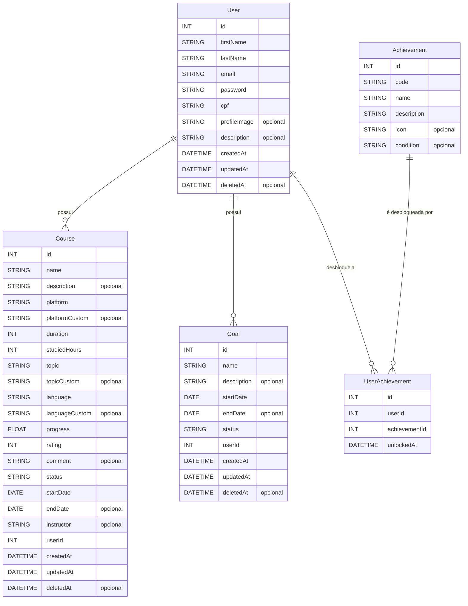

```mermaid
erDiagram
  User {
    INT id
    STRING firstName
    STRING lastName
    STRING email
    STRING password
    STRING cpf
    STRING profileImage "opcional"
    STRING description "opcional"
    DATETIME createdAt
    DATETIME updatedAt
    DATETIME deletedAt "opcional"
  }

  Course {
    INT id
    STRING name
    STRING description "opcional"
    STRING platform
    STRING platformCustom "opcional"
    INT duration
    INT studiedHours
    STRING topic
    STRING topicCustom "opcional"
    STRING language
    STRING languageCustom "opcional"
    FLOAT progress
    INT rating
    STRING comment "opcional"
    STRING status
    DATE startDate
    DATE endDate "opcional"
    STRING instructor "opcional"
    INT userId
    DATETIME createdAt
    DATETIME updatedAt
    DATETIME deletedAt "opcional"
  }

  Goal {
    INT id
    STRING name
    STRING description "opcional"
    DATE startDate
    DATE endDate "opcional"
    STRING status
    INT userId
    DATETIME createdAt
    DATETIME updatedAt
    DATETIME deletedAt "opcional"
  }

  Achievement {
    INT id
    STRING code
    STRING name
    STRING description
    STRING icon "opcional"
    STRING condition "opcional"
  }

  UserAchievement {
    INT id
    INT userId
    INT achievementId
    DATETIME unlockedAt
  }

  User ||--o{ Course : "possui"
  User ||--o{ Goal : "possui"
  User ||--o{ UserAchievement : "desbloqueia"
  Achievement ||--o{ UserAchievement : "é desbloqueada por"

```
