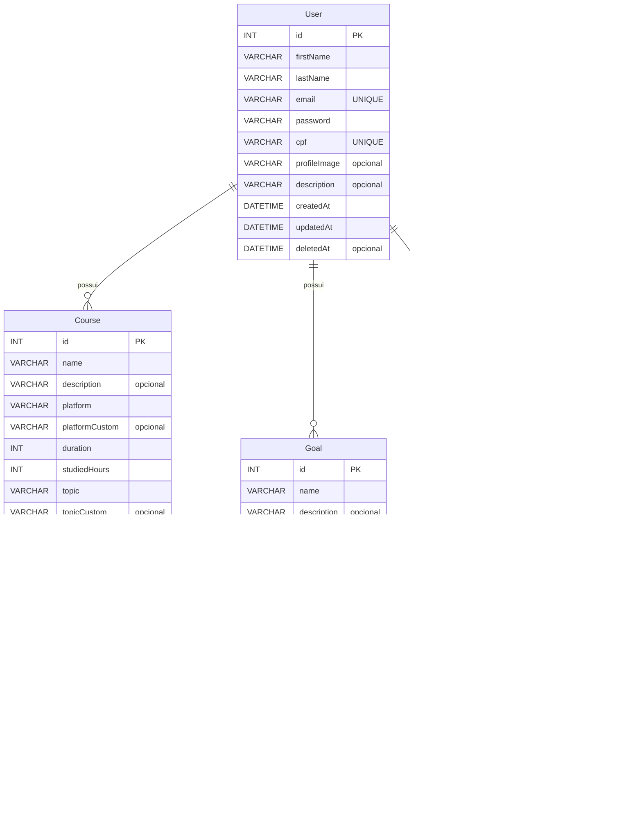

```mermaid
erDiagram
  User {
    INT id "PK"
    VARCHAR firstName
    VARCHAR lastName
    VARCHAR email "UNIQUE"
    VARCHAR password
    VARCHAR cpf "UNIQUE"
    VARCHAR profileImage "opcional"
    VARCHAR description "opcional"
    DATETIME createdAt
    DATETIME updatedAt
    DATETIME deletedAt "opcional"
  }

  Course {
    INT id "PK"
    VARCHAR name
    VARCHAR description "opcional"
    VARCHAR platform
    VARCHAR platformCustom "opcional"
    INT duration
    INT studiedHours
    VARCHAR topic
    VARCHAR topicCustom "opcional"
    VARCHAR language
    VARCHAR languageCustom "opcional"
    FLOAT progress
    INT rating
    VARCHAR comment "opcional"
    VARCHAR status
    DATE startDate
    DATE endDate "opcional"
    VARCHAR instructor "opcional"
    INT userId "FK"
    DATETIME createdAt
    DATETIME updatedAt
    DATETIME deletedAt "opcional"
  }

  Goal {
    INT id "PK"
    VARCHAR name
    VARCHAR description "opcional"
    DATE startDate
    DATE endDate "opcional"
    VARCHAR status
    INT userId "FK"
    DATETIME createdAt
    DATETIME updatedAt
    DATETIME deletedAt "opcional"
  }

  Achievement {
    INT id "PK"
    VARCHAR code "UNIQUE"
    VARCHAR name
    VARCHAR description
    VARCHAR icon "opcional"
    VARCHAR condition "opcional"
  }

  UserAchievement {
    INT id "PK"
    INT userId "FK"
    INT achievementId "FK"
    DATETIME unlockedAt
  }

  User ||--o{ Course : "possui"
  User ||--o{ Goal : "possui"
  User ||--o{ UserAchievement : "desbloqueia"
  Achievement ||--o{ UserAchievement : "é desbloqueada por"
```
